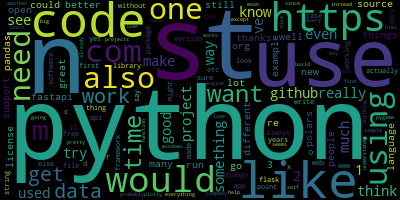

# Reddit Trending Topics
### Creating a trend topic application that displays a wordcloud of the most frequent words in the comment sections of a given subreddit, using [Reddit's API](https://www.reddit.com/dev/api/). 

## Follow the steps to run the code on your own:
<details>
<summary>1. Setting up a Python Virtual Environment (venv):</summary>

In your project's directory, run the following commands:

### Installing:
- Windows:
```
python -m venv myenv
```
- Linux/Mac:
```
python3 -m venv myenv
```

### Activating:
(make sure to activate venv in your terminal to install dependencies)
- Windows:
```
myenv/Scripts/Activate
```
- Linux/Mac:
```
source myenv/bin/activate
```

### Deactivating:
- Windows/Linux/Mac
```
deactivate
```

</details>

<details>
  <summary>2. Installing Required Dependencies:</summary>

- [Python Reddit API Wrapper (PRAW)](https://praw.readthedocs.io/en/stable/index.html#):
```
pip install praw
```
- [Python wordcloud](https://pypi.org/project/wordcloud/):
```
pip install wordcloud
```
- [Python dotenv](https://pypi.org/project/python-dotenv/):
```
pip install python-dotenv
```
- [Natural Language Toolkit (NLTK)](https://www.nltk.org/):
```
pip install nltk
```

To install NLTK data, create a python terminal typing `python/python3` command and run:
```python
import nltk
nltk.download('stopwords')
```
</details>


<details>
  <summary>3. Setting up Reddit's API Registration:</summary>

  To setup your API registration, follow the instructions in this [TUTORIAL.](https://www.geeksforgeeks.org/how-to-get-client_id-and-client_secret-for-python-reddit-api-registration/) 
</details>

<details>
  <summary>4. Securing API keys with '.env' file:</summary>
  create a file named '.env' and replace the values of your API keys in the environment variables. Here's an example:

### Windows Format:
```.env
REDDIT_CLIENT_ID=RedDitCliEntID0123456789
REDDIT_CLIENT_SECRET=clIeNTseCret0123456789
REDDIT_USER_AGENT=subreddit trending topics by u/your_reddits_username
```

### Linux/Mac Format:
```.env
export REDDIT_CLIENT_ID="RedDitCliEntID0123456789"
export REDDIT_CLIENT_SECRET="clIeNTseCret0123456789"
export REDDIT_USER_AGENT="subreddit trending topics by u/your_reddits_username"
```
</details>

## Results:
This wordcloud is an output example of the most commented words in the 'python' subreddit in May 2024, between 05-01 and 05-24



These are the top 15 most commented words, each one associated with it's frequency:
1. 's': 576
2. 'python': 545
3. 'n': 535
4. 't': 533
5. 'use': 470
6. 'like': 396
7. 'code': 367
8. 'https': 362
9. 'would': 307
10. 'using': 239
11. 'com': 222
12. 'need': 212
13. 'also': 211
14. 'one': 209
15. 'm': 187

